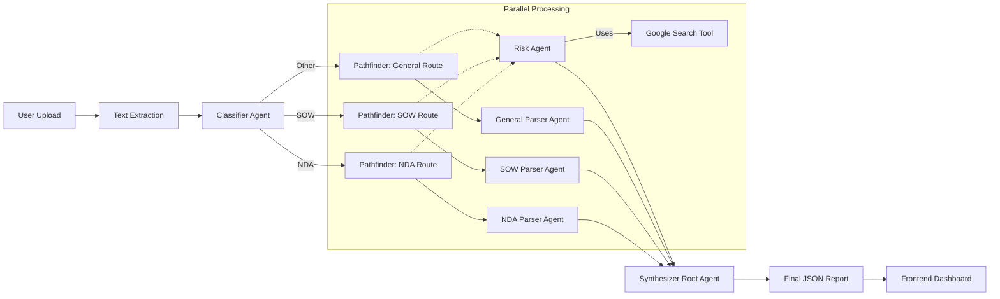
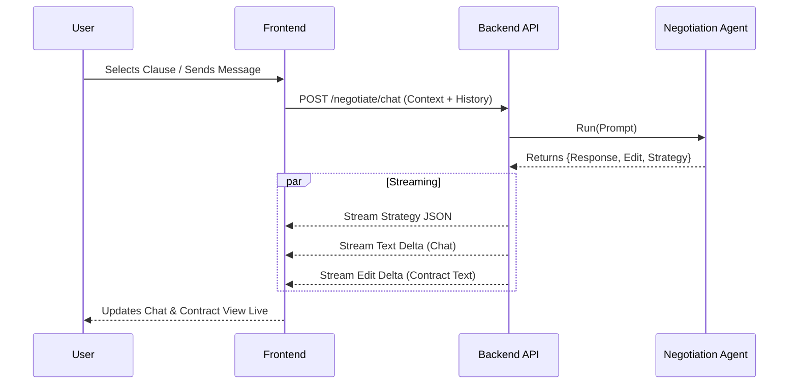
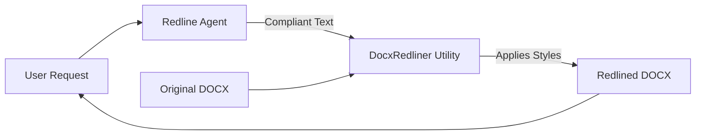
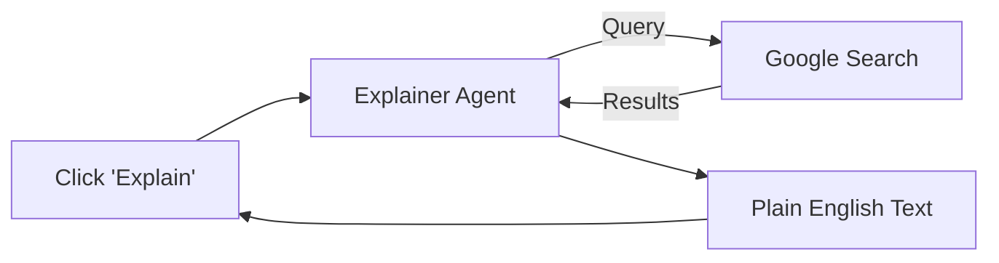

# LegalSay Backend & Agentic Workflows Documentation

## 1. System Overview

LegalSay is an AI-powered contract analysis and negotiation platform. The backend is built with **FastAPI** and utilizes **Google GenAI (Gemini 2.0 Flash)** via the **Google Agent Development Kit (ADK)** to orchestrate a multi-agent system.

The system is designed as a "Factory" of specialized agents that work together to:
1.  **Classify** contracts.
2.  **Extract** key details based on contract type.
3.  **Identify** risks and red flags (with legal citations).
4.  **Synthesize** a final report.
5.  **Negotiate** and **Redline** clauses in real-time.

---

## 2. Agent Catalog

| Agent Name | Role | Model | Tools | Input | Output |
| :--- | :--- | :--- | :--- | :--- | :--- |
| **ClassifierAgent** | Determines contract type (NDA, Freelance, Other, Irrelevant). | Gemini 2.0 Flash | None | Raw Text (First 2k chars) | `ContractType` (includes `IRRELEVANT`), `Confidence` |
| **GeneralParserAgent** | Extracts universal details (Parties, Date). | Gemini 2.0 Flash | None | Full Text | `parties`, `effective_date` |
| **NDAParserAgent** | Extracts NDA-specifics (Term, Conf. Def). | Gemini 2.0 Flash | None | Full Text | `term_duration`, `confidential_info_definition` |
| **SOWParserAgent** | Extracts SOW-specifics (Fees, Deliverables). | Gemini 2.0 Flash | None | Full Text | `fees`, `deliverables` |
| **RiskAgent** | Identifies Red/Yellow/Green flags & Missing clauses. | Gemini 2.0 Flash | **Google Search** | Full Text + Jurisdiction | `red_flags`, `yellow_flags`, `green_flags` |
| **LegalAgent (Root)** | Synthesizes all findings into a final report. | Gemini 2.0 Flash | None | All Agent Outputs | `ContractAnalysisOutput` (Summary, Score, JSON) |
| **NegotiationAgent** | Negotiates clauses and proposes edits. | Gemini 2.0 Flash | None | Contract, History, User Intent | `response`, `proposed_edit`, `strategy` |
| **RedlineAgent** | Rewrites a specific clause to be compliant. | Gemini 2.0 Flash | None | Clause, Jurisdiction, Risk | `compliant_text`, `explanation` |
| **ExplainerAgent** | Explains legal risks in plain English. | Gemini 2.0 Flash | **Google Search** | Risk Text, Context | `explanation` |

---

## 3. Workflows

### 3.1. Contract Analysis Workflow (The "Pathfinder" Loop)

This is the core flow triggered by `POST /analyze_contract/`.

1.  **Ingestion**: User uploads PDF/DOCX. Text is extracted.
2.  **Classification**: `ClassifierAgent` determines if it's an NDA, SOW, Other, or **Irrelevant**.
    *   *New*: If **Irrelevant**, the process stops immediately and returns a friendly message.
3.  **Routing (Pathfinder)**: Based on type, the system selects the appropriate Specialist (e.g., `NDAParserAgent`) and *always* includes the `GeneralParserAgent` and `RiskAgent`.
4.  **Parallel Execution**:
    *   Specialist extracts specific data.
    *   `RiskAgent` scans for dangers (using Google Search for case law).
5.  **Synthesis**: `LegalAgent` takes all outputs and generates the `ContractAnalysisOutput` JSON.

#### Graph Representation

---

### 3.2. Negotiation Workflow

Triggered by `POST /negotiate/chat/`. This enables the "Copilot" experience.

1.  **Context Building**: System aggregates the Full Contract, Analysis Results (Flags), and Chat History.
2.  **User Intent**: User selects a clause ("Negotiate this") or types a custom message.
3.  **Agent Action**: `NegotiationAgent` processes the request.
4.  **Streaming Response**: The agent returns a strategy, a conversational response, and the *full updated contract text*.
5.  **UI Update**: Frontend streams the text and updates the "Contract View" in real-time.

#### Graph Representation

---

### 3.3. Redlining Workflow

Triggered by `POST /redline_clause/`. Used for precise, document-level edits.

1.  **Input**: User selects a "Red Flag" clause.
2.  **Generation**: `RedlineAgent` rewrites the clause to be compliant with the specific Jurisdiction.
3.  **Document Manipulation**: `DocxRedliner` (Python utility) locates the original text in the uploaded DOCX.
4.  **Redlining**: It applies Word-native tracking changes (Strikethrough Red / Underline Blue).
5.  **Output**: Returns the modified binary DOCX file.

#### Graph Representation

---

### 3.4. Risk Explanation Workflow

Triggered by `POST /explain_risk/`.

1.  **Input**: User clicks "Explain" on a specific Red/Yellow flag.
2.  **Research**: `ExplainerAgent` uses **Google Search** to find relevant statutes or legal context for the Jurisdiction.
3.  **Output**: Returns a plain-English explanation citing the sources found.

